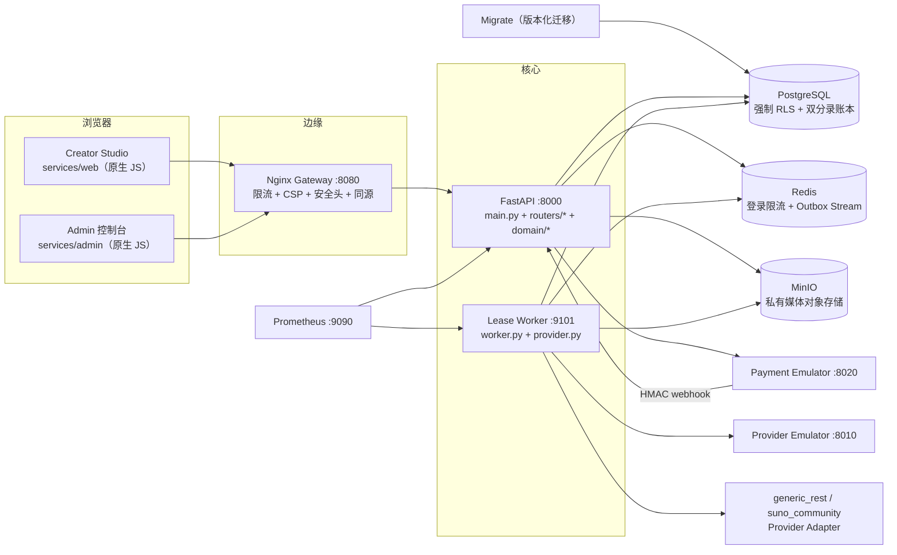
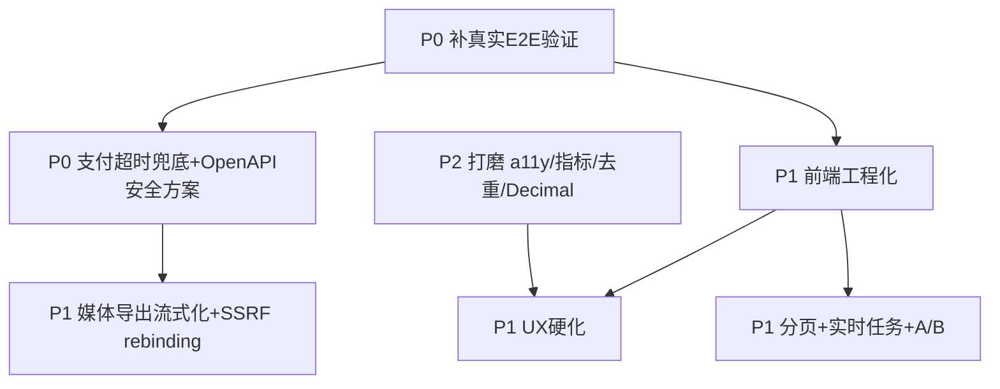

# Resonance（AI 音乐资产平台）代码走读与架构评审报告

> 评审对象：`/Volumes/Extra/CodeProj/web3_music`（入库内容以 `git ls-files` 为准，写下这句的 2026-09-28 数到 347 个——这是时点读数，不随仓库增长自动更新，Python/FastAPI + 原生 JS + PostgreSQL + Redis + MinIO + Docker Compose + Prometheus + K8s）
> 评审方式：逐目录层级源码走读（只读，未改动任何业务代码）
> 评审结论一句话：**后端领域能力基本完整，但「代码层面全部实现」不成立 —— 前端是功能骨架级（压缩单文件 JS + `prompt()` 交互 + 无加载/空/错误态），且真实跨容器 E2E 从未在本交付环境执行过，只有 28 个静态/单元级测试的日志作为"证据"。**

---

## 1. 架构总览

### 1.1 组件拓扑



### 1.2 分层

| 层 | 目录 | 职责 |
|---|---|---|
| 表现层 | `services/web`、`services/admin` | 原生 JS 单页应用，无构建步骤，Nginx 托管 |
| 边缘层 | `services/gateway` | 统一同源入口、限流、CSP、安全响应头 |
| 应用/API 层 | `services/api/app` | FastAPI：`main.py`（旧式路由）+ `routers/`（模块化路由）+ `domain/`（纯领域逻辑）+ `auth.py`（会话与令牌）+ `mfa.py`（第二因子材料与密封） |
| 异步执行层 | `services/worker` | PostgreSQL Lease Worker（领取/心跳/重试/死信）、Provider Adapter、媒体入库、结算 |
| 仿真/测试层 | `services/provider-emulator`、`services/payment-emulator`、`services/acceptance`、`services/loadtest` | 故障实验室、支付模拟、端到端验收、容量压测 |
| 契约层 | `shared/contracts` | `authority-matrix.json`（100 条路由 / 54 条写操作的权限派生件，其中 5 条写路由另带「当场再交出凭据」这一列，与 `docs/AUTHORITY_MATRIX.md` 成对）+ OpenAPI v13（90 paths，含 `/api/account/export`、`/api/account/erasure`、五个 `/api/auth/mfa/*`、三条 `/api/workspace/members*` 与 5 条 `/api/workspace/invitations*` / `/api/account/invitations*`）+ JSON Schema |
| 数据层 | `db/migrations`（2026-09-28 现数 22 份）、`db/bootstrap` | 领域表、RLS、约束/触发器/索引、种子数据、角色 |
| 基础设施层 | `infrastructure/prometheus`、`infrastructure/kubernetes` | 指标抓取、生产参考部署 |
| 运维层 | `scripts/`（同日现数 42 份，与本文「运维层」之外那条 scripts 清单同一个数） | 启动/验证/Chaos/备份恢复/发布证据/容量 Gate/四条常驻演练 |

### 1.3 关键信任边界（与文档声明核对）

- **JWT 只证身份，不证租户**：`auth.py:get_user` 只解析 user_id/session_id；`get_actor` 每次请求从 `workspace_members` 重新解析角色与工作区。✔ 属实。
- **PostgreSQL RLS 第二层隔离**：`db/migrations/001` 与 `002` 通过 `DO $$ ... EXECUTE format('ALTER TABLE %I FORCE ROW LEVEL SECURITY')` 循环对 **17 + 19 张领域表**强制 RLS，`music_app` 无 `BYPASSRLS`。✔ 基本属实（`users/workspaces/workspace_members/system_settings/audit_events/auth_sessions/payment_inbox/domain_outbox/provider_inbox/provider_capability_snapshots` 等全局/跨租户表刻意不加 RLS，靠应用层控制）。
- **双分录账本**：`ledger_transactions(workspace_id, operation_key)` 唯一 + `ledger_must_balance` 延迟约束触发器 + 追加不可变触发器。✔ 属实。
- **媒体只存私有桶 + 短期签名 Token**：`storage.py:sign_media_token/verify_media_token` + `worker.py:validate_url` SSRF 防护。✔ 基本属实，但存在 DNS-rebinding TOCTOU 缺口（见 §4 P1-4）。

---

## 2. 逐模块走读纪要

### 2.0 根目录（工程治理）

| 文件 | 评估 |
|---|---|
| `README.md` | 质量高：闭环图、启动、验证、安全边界、外部前置条件、500 并发包说明齐全；并**诚实声明**"500 并发未经实测""正式上线需外部证据"。 |
| `Makefile` | 薄封装，指向 `scripts/*`，职责清晰。 |
| `.env.example` | 变量齐全、注释到位、带 v14 容量参数。**注意**：`DB_POOL_MAX=16` 与 `settings.py` 默认 `12` 不一致（§4 P2-10）。 |
| `docker-compose.yml`（+3 个 override） | 12 服务编排正确；`depends_on` 用 healthcheck/`service_completed_successfully`；密码硬编码（`music_admin`/`minioadmin`），生产 override 用 `${VAR:?}` 强制注入。 |
| `SOURCE_MANIFEST.sha256`、`release-evidence/` | 存在源码清单与发布证据包，但 `static-verify.log` 只记录 **28 个单元测试通过**，无 Docker E2E 证据。 |
| `LICENSE`/`SECURITY.md`/`THIRD_PARTY_NOTICES.md` | 合规文档齐全；SECURITY 明确列出"本地演示刻意保留的边界"与"对外部署前强制要求"。 |

**治理评价**：文档与工程化意识**高于一般参考项目**；但"发布证据"里最关键的一条（真实 E2E）是缺失的。

### 2.1 `services/api`（FastAPI 后端，核心）

**入口 `services/api/app/main.py`（1295 行）**：
- 路由装配：`main.py` 内联了旧式路由（auth/projects/jobs/candidates/media/master/assets/ledger/provider-webhook/admin 总闸），末尾 `include_router` 四个模块化 router（creation/assets/market/admin_v12）。
- 中间件 `request_context`：注入 `X-Request-Id`、全局 CSRF 校验、安全头、Prometheus 计时。
- 关键端点：`login/refresh/logout/me`、`bootstrap`、`projects` 全 CRUD、`chat`（AI Patch）、`quality`、`quotes`、`jobs`（幂等提交）、`media-token/stream_media`、`master`、`assets/export`、`ledger`、`provider-webhooks`、`admin/*`。

**`services/api/app/settings.py`（142 行）**：`@dataclass(frozen=True)` + `os.getenv`（导入期读取，不可热重载）；无 secrets 变更校验（文档已声明演示值）。

**`services/api/app/db.py`（133 行）**：自研 `ThreadedConnectionPool` + `BoundedSemaphore` 背压；`transaction()`/`fetch_one()`/`fetch_all()` 每次 `set_config('app.workspace_id', ..., true)` 设置租户上下文驱动 RLS。**注意**：`fetch_one/fetch_all` 每次新建连接，一个请求多次查询 = 多次取连接（无请求级连接复用）。

**`services/api/app/auth.py`（291 行）**：PBKDF2-SHA256 验密；JWT（HS256，aud/iss/jti/nbf/exp）；`create_browser_session`（refresh_token_hash/csrf_token_hash 服务端哈希存储）；`validate_browser_csrf`（双提交 Cookie + 服务端哈希比对）；`get_actor`（每次请求解析 membership + role）；`require_roles/require_platform_admin`。**认证链严谨**。

**`app/domain/`（领域纯逻辑）**：
| 模块 | 职责 | 质量 |
|---|---|---|
| `ledger.py` | 双分录 `post()`（operation_key 幂等 + 平衡校验 + `FOR UPDATE`）、`create_hold/close_hold/refund` | 好；`balances()` 返回 **float**（§4 P2-7） |
| `rights.py` | `build_manifest`（9 项能力分项 allowed/blocked/manual_review/unknown）、`allowed()` | 好 |
| `commerce.py` | `issue_credits/revoke_credits/assert_offer_rights/order_number` | `issue/revoke` 用普通 SELECT 无 `FOR UPDATE`（§4 P2-6） |
| `services/api/app/domain/quality.py`（399 行） | 28 维确定性质量引擎（PAC/TSMI/NSRQ/C3AC + TEE 数学逐字实现） | 好，确定性可复现，单测覆盖 |
| `moderation.py` | 确定性 Policy Preflight（阻断声音克隆/冒充；艺人风格/第三方素材转人工） | 好，但刻意窄 |
| `patches.py` | JSON Patch（add/replace/remove + 锁定父/子路径） | 数组越界未捕获 → 潜在 500（§4 P2-5） |
| `deepseek.py` | DeepSeek 结构化 Patch 提案 + 本地确定性回退；共享 AsyncClient | 好 |
| `events.py` | Transactional Outbox `emit()` | 好 |

**`app/routers/`**：`creation.py`（分支/评论/偏好/事件/分析）、`assets.py`（资产清单/溯源/权利证据/权利复核/审核案件）、`market.py`（668 行，额度/订阅/订单/支付/退款/Offer/License/Delivery/Payout/Brand Brief/Support）、`admin_v12.py`（运营控制面/对账/发布证据/Payout 队列）。

**请求生命周期（写路径）**：
```
HTTP → gateway → request_context(CSRF/安全头) → get_user(鉴权) → get_actor(成员/角色)
→ require_roles(...) → 路由处理器 → transaction(workspace_id)[set_config 租户 + RLS]
→ domain 校验 → SQL + emit(outbox) + audit → commit → 响应
```

### 2.2 `services/worker`（异步执行层）

- `services/worker/worker.py`（504 行）：`claim_job`（`FOR UPDATE SKIP LOCKED` 原子领取 + 状态机）、`heartbeat`（租约续期）、`process`（提交→轮询→入库→结算）、`publish_outbox`（至少一次投递 Redis Stream）、`consume_inbox`（处理 Provider/Payment webhook 状态提示）、`sample_queue_metrics`。
- 任务状态机：`queued → leased → submitting → provider_queued → processing → ingesting → completed/partial/failed`，`cancel_requested → cancelled`，异常走 `retry_wait`（指数退避）或 `dead_letter`（释放 Hold）。
- `services/worker/provider.py`（358 行）：`ProviderAdapter` 抽象 + `EmulatorAdapter` + `GenericRESTAdapter`（contract-first）+ `SunoCommunityAdapter`（仅开发）。`create_adapter` 用 `@lru_cache`。
- `ledger.py`：**与 `app/domain/ledger.py` 重复实现**（§4 P2-8）。
- `metrics.py`：依赖零的 Prometheus 端点。

**SSRF 防护**：`validate_url`（协议白名单、HTTPS 强制、DNS 解析 + 私网/环回/链路本地/组播/保留地址阻断、内部 Host Allowlist）+ 重定向逐跳重验 + MIME/大小/ffprobe 解码/SHA-256。**缺口**：DNS 解析与真实连接存在 TOCTOU（rebinding）（§4 P1-4）。

### 2.3 `services/web` 与 `services/admin`（前端，体验重点）

**文件体量**（印证"体验偏薄"；下表是本次静态审查当时的快照，四份前端文件此后先被还原成多行源码、又加过功能，今天的字节数与行数见本文末"前端体量"那条，两者不是同一个量）：
| 文件 | 字节 | 行数（压缩后） |
|---|---|---|
| `web/app.js` | 32,294 B | 117 行（单行压缩） |
| `web/index.html` | 10,586 B | 116 行 |
| `web/styles.css` | 13,838 B | 4 行（压缩） |
| `admin/admin.js` | 11,144 B | 17 行（压缩） |
| `admin/index.html` | 3,438 B | 12 行 |
| `admin/styles.css` | 5,054 B | 1 行（压缩） |

**信息架构其实不差**：web 有 创作/资产/市场/账户 四视图，admin 有 总览/任务/财务/信任/发布证据 五视图，与后端 69 条 API 基本对齐。**但交互深度明显不足**（见 §5）。

**JS 关键实现**：
- `api()` 封装：Cookie + CSRF 双提交；401 时自动 `/api/auth/refresh` 重试一次；`credentials:'same-origin'`。`state.token` 恒为空 → 依赖 HttpOnly Cookie（符合 v13 设计，但登录响应里的 `access_token/csrf_token` 被前端丢弃，属历史遗留死字段）。
- 错误处理：`JSON.stringify(detail.detail ?? detail)` 直接弹 toast → **用户看到原始 JSON**（§4 P1-6）。
- `fmtMoney` 除以 100（价格以"分"为单位，未文档化的隐式约定）。

### 2.4 仿真与验收服务

| 服务 | 职责 | 质量 |
|---|---|---|
| `provider-emulator` | 持久化 SQLite 音乐供应商故障实验室（success/partial/failed/timeout/rate_limited），确定性 WAV 生成 | 好，契约可测 |
| `payment-emulator` | 支付/退款意图 + HMAC 签名回调（后台线程延迟 0.8s） | 好；`processing/requires_action` 场景不回调 → 订单永久卡住（§4 P1-3） |
| `migrate` | 版本化迁移（SHA-256 校验和，防篡改） | 好 |
| `gateway` | Nginx 限流/CSP/安全头/前缀剥离 | 好；`proxy_next_upstream` 对非幂等写请求可能重放（标准坑） |
| `acceptance` | 4 个 E2E 测试（默认/商业/Provider 契约/Payment 契约） | **代码完整且覆盖深，但交付环境未执行** |
| `loadtest` | `load-test-500.py` 500 用户异步压测 | 仅 GET 读路径（README 已诚实声明不等于生成任务压测） |

### 2.5 `shared/contracts`（契约层）

- `openapi-v13.json/yaml`：**69 条路径、33 个 schema，但 `securitySchemes: []`（空）** → 安全模型未文档化（§4 P1-5）。
- JSON Schema：顶层 8 个（song-spec-runtime、generation-job-v3、license-v1、order-v1、rights-evidence-v1、payment-event-v1、product-event-v1、brand-brief-v1、credit-hold）+ `design-reference/` 8 个旧版。
- **关键事实**：运行时**只有 `song-spec-runtime-v1.schema.json` 被 `contracts.py` 真正加载校验**，其余 Schema 是"设计参考/文档事实源"，未在代码中执行（grep 确认无其他引用）。"JSON Schema 作为事实源"的说法**部分成立**——OpenAPI 是运行时导出的、SongSpec Schema 是强制的，但其余 Schema 与代码一致性无人自动校验（仅 `static-verify.sh` 做元模式校验 `check_schema`）。

### 2.6 `db/migrations` + `bootstrap`

- 6 个迁移：001（25 表核心域）、002（26 表市场/商业）、003（跨租户外键 + Payout 不可变 + License 模板 RLS）、004（Brand Award 流程 + SECURITY DEFINER 函数）、005（auth_sessions/moderation_decisions + 不可变触发器）、006（容量索引）。
- 亮点：`ledger_must_balance` 延迟约束触发器、`FORCE ROW LEVEL SECURITY` 批量循环、`prevent_immutable_mutation` 触发器（Revision/Asset/Rights/Ledger 追加不可变）、`payout_transition_guard` 状态机、`reserve_marketplace_offer` 等 SECURITY DEFINER 函数把并发/权限收口到 DB。
- `bootstrap/00_roles.sql`：`music_app`（NOINHERIT，无 BYPASSRLS）、`music_worker`（NOINHERIT + **BYPASSRLS** 用于跨租户领取任务）。

### 2.7 `infrastructure` + `scripts` + `tests` + CI

- `prometheus.yml`：抓 `api:8000/metrics` + `worker:9101/metrics`（无认证，已声明仅本地）。
- `kubernetes/`：`resonance-apps.yaml`（Deployment×5 + Service）+ `resonance-capacity-500.yaml`（HPA api/worker min2 max10 + PDB + rollingUpdate maxUnavailable 0），占位镜像 `registry.example.com`，需外置 Secret controller。
- `scripts/`（2026-09-28 现数 42 份文件，含 `requirements-browser.txt`、`requirements-load.txt` 两份测试侧依赖清单）：`up/test/smoke/reset`、`static-verify`、`architecture-audit`（**基于字符串包含的“契约审计”**，非真实架构校验）、`contract-test`、`chaos-worker-recovery` + `chaos_worker_recovery.py`（Kill-9 恢复 + 额度泄漏校验，质量高）、`lease-contention` + `lease_contention.py`、`backup/restore/verify-backup`、`restore_fidelity.py`（绝对指纹：逐账户账本余额 + 每个资产 master 音频 sha256）、`capacity-gate-500`、`load-test-500.py`、`release-evidence`、`source-manifest.sh`、`export-openapi.sh`、`generate-secrets`（**生成 `POSTGRES_*` 密码但 compose 未消费**，§4 P2-9）；链上常驻演练 `erasure_drill.py` / `mfa_drill.py` / `member_drill.py` / `media_scan_drill.py` / `report_drill.py` 五支（各自以 `N/N checks passed` 结尾，跑在宿主 Python 里、连真栈真库），另有浏览器门禁 `browser_a11y.py`（`BROWSER=1` 才在本地跑，CI 每次跑）；批量与对账 `provider_regression.py`、`reconcile_market.py`、`reservation_race.py`；以及 `authority_matrix.py`（从路由装饰器派生权限矩阵，`--check` 接进 `static-verify.sh`）与 `e2e_client.py`——它的 `totp_code()` 是从 RFC 6238 现写的 stdlib 实现，与被测服务端用的 pyotp 不同源，否则「演练绿」只说明两侧犯了同一个错。
- `tests/unit`（本轮实测 44 个文件、`pytest -q tests/unit --collect-only -q` 读出 456 个收集实例，含参数化展开）：定位为**无栈的静态与纯函数判据**——`test_v13_final.py` 仍用 `psycopg2` stub 规避 DB 依赖；只有两个 emulator 测试用了 `TestClient`。本文件原先那句「**无任何 FastAPI 主应用 + 真实 PostgreSQL 的测试**」已被现实推翻，按现在的形状改写：真应用 + 真库那一层由链上五支演练承担（`erasure/mfa/member/media_scan/report`，各自用 httpx 打 `127.0.0.1:8000`、用 psql 打同一个 compose 里的库），静态侧补的是那些演练所依赖的接线（`test_db_refusal.py` 拿真 `psycopg2.Error` 去调用那个映射函数，`test_report_surface.py` 比对 Python 词表与 021 的 CHECK 名单）。两侧不是重叠：演练量行为，静态量「判据赖以成立的形状还在不在」。
- `.github/workflows/ci.yml`：三 job —— `static-and-unit`、`compose-acceptance`（真实起 Docker + acceptance + contract + chaos + backup/restore）、`commercial-flow`。**CI 已编码完整 E2E，但本仓库无 CI 通过证据**（`git_commit=unavailable`，release-evidence 仅静态 log）。

---

## 3. 依赖关系

### 3.1 外部依赖（运行时）

- **数据/存储**：PostgreSQL 16、Redis 7、MinIO（S3 兼容）。
- **中间件/语言**：FastAPI 0.116.1、Uvicorn 0.35.0、Pydantic 2.11.7、Psycopg2-binary 2.9.10、PyJWT 2.10.1、HTTPX 0.28.1、Boto3 1.40.4、jsonschema 4.25.0、python-dotenv、redis 6.4.0。
- **系统**：FFmpeg（worker 镜像内 apt 安装，用于 ffprobe 解码校验）。
- **前端**：零第三方框架（原生 JS + 原生 CSS），Nginx 1.27-alpine。

### 3.2 内部模块间依赖（Py 包清单见 `services/*/requirements.txt`）

```text
api.app.main ──> api.app.{auth,db,storage,contracts,metrics,settings}
            └──> api.app.domain.{ledger,rights,commerce,moderation,patches,deepseek,events,utils}
            └──> api.app.routers.{creation,assets,market,admin_v12}
worker ──> worker.{provider,ledger,metrics}   （worker.ledger 与 api.domain.ledger 逻辑重复）
api ──HTTP──> payment-emulator（支付/退款）
worker ──HTTP──> provider-emulator | generic_rest | suno_community
api/worker ──> Redis（限流 / outbox stream）
api/worker ──> MinIO（媒体）
```

### 3.3 契约一致性

| 契约 | 事实源 | 与代码一致性 |
|---|---|---|
| OpenAPI v13（90 paths） | 由运行中的 FastAPI `/openapi.json` 导出 | 一致（`export-openapi.sh`）；`securitySchemes` 现在带 `JWTBearer` 与 `SessionCookie` 两项（本文早期版本记的是"空"，那一句与下面证据索引里同一行的 `paths=71` 快照同时写下，读的是当时那份导出件） |
| `song-spec-runtime-v1` | `contracts.py` 运行时强制 | 一致（单测覆盖） |
| 其余 JSON Schema | `shared/contracts/*.schema.json` | **仅文档，运行时未校验** |
| Provider 契约 | `docs/PROVIDER_ADAPTER_CONTRACT.md` + `test_provider_contract.py` | 一致（未执行） |

---

## 4. 代码质量问题清单（按严重度）

> 说明：整体工程质量中上。**未发现会导致账本/资金/租户隔离被直接攻破的 P0 级代码缺陷**；真正需要立刻补的是"验证可信度"（E2E 未跑）与"前端体验债"。

### P0（阻断上线 / 验证可信度）

| # | 位置 | 问题 | 建议 |
|---|---|---|---|
| P0-1 | 全仓库 | **真实 E2E 从未在交付环境执行**。`release-evidence/.../static-verify.log` 仅 `28 passed in 3.62s`；`environment.txt` 显示 `git_commit=unavailable`；`FINAL_RELEASE_STATUS.md`/`TEST_REPORT.md` 自认"无 Docker daemon，跨容器验收需在部署主机执行"。 | 在具备 Docker 的主机执行 `compose-acceptance` + `commercial-flow` + `chaos` + `backup/restore`，产出并落盘真实运行证据，替换掉"静态验证即宣称可发布"的叙事。 |
| P0-2 | `services/api/app/routers/market.py:212-273`（pay_order） | `PaymentStart.scenario` 允许 `processing/requires_action`，但 `payment-emulator` 对这两种场景**永不回调**（`payment-emulator/main.py:101-111`），订单将永久停在 `payment_pending`，无超时回滚/对账兜底。 | 增加"支付超时 → 订单回 `pending`/支付标 `failed`"的兜底（定时对账或 Webhook 缺失补偿），并在验收中覆盖 `processing` 场景。 |
| P0-3 | `shared/contracts/openapi-v13.json` | `securitySchemes: []`，API 实际要求 JWT Bearer 或 Cookie+CSRF，但 `/docs` 无法鉴权调用，安全契约缺失。 | 在 FastAPI 路由上声明 `HTTPBearer` + APIKey/cookie 安全方案，重新导出 OpenAPI，并在 CI 校验 `securitySchemes` 非空。 |

### P1（应尽快修复）

| # | 位置 | 问题 | 建议 |
|---|---|---|---|
| P1-1 | `services/web/app.js`、`services/admin/admin.js` | 前端为**压缩单文件**（32KB/11KB），无构建步骤、无 sourcemap、无模块化 → 任何 UX 迭代都高风险、不可维护。 | 引入 Vite（或至少 ES Modules + sourcemap），把压缩产物还原为可维护源码，`Dockerfile` 增加 build 阶段。 |
| P1-2 | `services/api/app/routers/market.py:517-533`、`main.py:406-412` | `export_delivery`/`export_asset` 将整段音频 `obj["Body"].read()` + `archive.getvalue()` **全量载入内存**（媒体上限 50MB，单请求可吃数百 MB）。 | 流式下载 + 流式写 ZIP（或先落临时文件），限制导出包大小。 |
| P1-3 | `services/worker/worker.py:142-150, 152-202` | SSRF `validate_url` 只解析一次 DNS 即放行，真实 HTTP 连接会**重新解析** → DNS-rebinding TOCTOU 可绕过私网阻断（README 自己也把"DNS Rebinding 专项"列为未做项）。 | 连接前用固定 IP 直连 + 校验（或自定义 transport 把解析与连接绑定到同一 IP），补 rebinding 专项测试。 |
| P1-4 | 多个 list 端点（`main.py:226 list_projects`、`assets.py:63 list_assets`、`market.py:431/438/495/500/536/657` 等） | 大量列表**无 LIMIT/分页**，数据增长后一次性拉全表。 | 统一分页参数（`limit/offset` 或 cursor），前端配合分页/滚动加载。 |
| P1-5 | `services/api/app/domain/moderation.py`（整个模块） | 内容策略仅 2 条 BLOCK + 3 条 REVIEW 正则，`manual_review` 无人工队列闭环（`moderation_decisions` 表已建但无审核工作流 UI/API）。 | 补人工复核队列（API + Admin 控制面），把 `review` 决策真正闭环。 |
| P1-6 | `services/web/app.js` `api()` 错误分支 | 错误用 `JSON.stringify(detail.detail ?? detail)` 直接弹 toast → 用户看到 `{"code":"revision_conflict",...}` 原始 JSON。 | 建立错误码→人类可读文案映射表，前端统一渲染。 |

### P2（工程化/健壮性）

| # | 位置 | 问题 | 建议 |
|---|---|---|---|
| P2-1 | `services/api/app/main.py:272-285`（`chat`） | `async def chat` 内直接执行**同步** `transaction()`（psycopg2 阻塞）→ 阻塞事件循环。 | DB 操作切 `run_in_executor` / 或改用 async 驱动。 |
| P2-2 | `services/api/app/metrics.py` + `services/api/Dockerfile:10`（`--workers N`） | 指标为**进程内 Counter**，`API_WORKERS>1` 时 `/metrics` 只反映随机一个 worker，多进程指标失真。 | 引入共享指标（Redis/独立 metrics 进程/`prometheus_client` multiprocess 模式）。 |
| P2-3 | `services/api/app/domain/ledger.py:12-19` | `balances()` 返回 `float`，财务/额度用浮点（当前额度为整数尚安全，但属坏味道）。 | 全链路统一 `Decimal` 或整数分。 |
| P2-4 | `services/api/app/routers/market.py:639-654` | `review_submissions/update_submission` 用 `except Exception → 403 "brief owner required"`，把 DB 故障等真实错误误报为权限错误。 | 区分业务异常（403）与系统异常（500/重试）。 |
| P2-5 | `services/api/app/domain/patches.py:23-30, 52-85` | JSON Pointer 数组下标 `int(part)` 越界抛 `IndexError`，未转成 422/409 → 潜在 500。 | 捕获并转 `PatchError`。 |
| P2-6 | `services/api/app/domain/commerce.py:20-38, 52-74` | `issue_credits/revoke_credits` 用普通 SELECT 判重（无 `FOR UPDATE`），并发同 key 会撞唯一约束返回 500（当前被订单/支付行锁兜底，风险低）。 | 统一走 `ledger.post()` 的 `FOR UPDATE` 幂等路径。 |
| P2-7 | `services/api/app/common.py` 与 `main.py` | `serialize/audit/setting_enabled` **重复定义两份**（main 自造一份，routers 用 common 一份），存在漂移风险。 | 收敛到 `common.py`，main.py 引用。 |
| P2-8 | `services/worker/ledger.py` vs `app/domain/ledger.py` | 双分录逻辑**两处独立实现**，必须手工同步。 | 抽公共库或让 worker 引用 API 包内的纯领域模块。 |
| P2-9 | `scripts/generate-secrets.sh` | 生成 `POSTGRES_*_PASSWORD` 但 `docker-compose.yml` 硬编码密码、`bootstrap/00_roles.sql` 硬编码角色密码，脚本产物无人消费。 | 让 compose/bootstrap 读环境变量，或删除误导项。 |
| P2-10 | `services/api/app/settings.py:47` vs `.env.example:51` | `DB_POOL_MAX` 默认 `12` vs `.env.example` `16`，不一致。 | 统一默认值。 |
| P2-11 | `services/payment-emulator/Dockerfile` | 用 `python:3.13-slim`，其余服务 `3.12-slim`，基础镜像不统一。 | 统一 Python 版本。 |
| P2-12 | `services/api/app/main.py:125-127` | `@app.on_event("startup"/"shutdown")` 已废弃。 | 改用 `lifespan`。 |
| P2-13 | `services/api/app/main.py:164-165`（login 限流） | `rq.incr` + `rq.expire` 非原子，两命令间进程崩溃会**永久锁死该邮箱**。 | 用 `rq.incr` 后 `SET NX EX` 或 Lua 脚本保证原子性。 |
| P2-14 | `services/worker/worker.py:344-355`（`consume_inbox`） | `supports_webhooks=true` 但 webhook 只更新 `provider_status`，**任务完成仍靠轮询**，webhook 能力名不副实。 | 明确语义：webhook 仅作状态加速，或真正用 webhook 驱动结算。 |

---

## 5. 用户体验 / 产品深化机会清单（重点）

> 每条：当前缺什么 → 怎么改 → 影响面。

### 5.1 前端工程化是"深化"的前置阻塞（影响面：全部）

- **现状**：`app.js`/`styles.css`/`admin.js` 是压缩产物，无源码、无构建、无 sourcemap；改一行就要在压缩文本里动刀。
- **怎么改**：引入 Vite + 原生 JS（或 React/Vue），还原为模块化源码 + sourcemap + ESLint/a11y 检查 + 构建产物缓存。
- **影响面**：**最大**——后续所有 UX 深化都建立在此之上。

### 5.2 加载 / 空 / 错误态几乎为零（影响面：核心流程）

- **现状**：`app.js` 中 `loading`/`spinner` 出现 **0 次**；聊天、质量评估、任务提交、支付等异步操作点击后无任何"进行中"反馈，仅靠最终 toast；列表空态只有一句"暂无评论/选择项目后显示"。
- **怎么改**：统一 Button 级 loading（防重复提交）、骨架屏/空态插画、错误码→人话映射（§4 P1-6）、失败可重试。
- **影响面**：高——直接影响"像不像一个能用的产品"的第一印象。

### 5.3 `window.prompt()/confirm()` 充当所有表单（影响面：全产品）

- **现状**：`app.js` 用了 **16 次 `prompt()` + 4 次 `confirm()`**（新建项目、分支、许可人名称、退款原因、工单主题/描述……）；虽已有 `<dialog>` + `showDialog()`，却只在 3 处使用。
- **怎么改**：用 `<dialog>`/Modal 表单替换全部 prompt/confirm，字段带校验、默认值、错误提示。
- **影响面**：高——是"体验偏薄"最直接的证据。

### 5.4 任务生命周期无实时可视化（影响面：生成核心）

- **现状**：`waitJob` 每 1.2s 轮询 90 次（~108s）后放弃提示"仍在后台运行，可稍后刷新"；后端 `generation_steps`（submit→ingest→settle）**未被前端渲染**。
- **怎么改**：渲染步骤时间线（报价→冻结→提交→Provider→入库→结算）；用 SSE/WebSocket 替代轮询；任务结束自动刷新候选与余额。
- **影响面**：高——生成是产品主链路。

### 5.5 候选试听缺 A/B 对比（影响面：核心卖点"选择 Master"）

- **现状**：README 宣称"A/B 试听与 Master Selection"，后端也采集 `ab_choice/candidate_played`，但前端只有零散 `<audio>`，无并排 A/B 对比、无波形/时长/质量联动。
- **怎么改**：A/B 盲听切换、播放进度/波形、一键设为 Master、把选择行为回写 `/api/events`。
- **影响面**：高——直击"AI 音乐创作"的产品价值。

### 5.6 28 维质量评估"有数据无表达"（影响面：差异化卖点）

- **现状**：仅一个分数 + 28 格 `<div>`，无雷达图/分维度解释，用户看不懂 `PAC/TSMI/NSRQ/C3AC`。
- **怎么改**：雷达图/维度分组（Core/Important/Auxiliary）、hover 解释、风险项高亮与改进建议。
- **影响面**：中高——质量引擎是最差异化的功能，当前被"压扁"。

### 5.7 列表无搜索/分页/筛选（影响面：资产/订单/工单）

- **现状**：项目/资产/订单/许可/工单全部一次性渲染，无分页、无搜索、无状态筛选。
- **怎么改**：分页 + 搜索 + 状态 Tab（对应后端已具备的字段）。
- **影响面**：中——数据量上来后必现。

### 5.8 无障碍（a11y）缺失（影响面：合规与可用性）

- **现状**：`aria-*` 出现 **0 次**、`tabindex` 0 次；`<dialog>` 无焦点管理；innerHTML 生成的交互元素无 ARIA。
- **怎么改**：语义化标签 + ARIA + 键盘导航 + 焦点陷阱 + 对比度检查。
- **影响面**：中（合规）——也是从"demo"到"产品"的标志。

### 5.9 Admin 控制面是"只读看板 + prompt"（影响面：运营）

- **现状**：总览/对账/发布证据可看，但大量运营动作（处理工单、审核案件、Payout 审批）在后端有 API、前端却未完整暴露或仅靠 prompt 输入。
- **怎么改**：把 `admin_v12` 的能力（对账、案件、Payout 队列、发布门禁）做成可操作的表格 + 抽屉详情 + 批量操作。
- **影响面**：中——运营控制面是"信任层"的门面。

### 5.10 其他（影响面：低-中）

- 无 i18n 框架（硬编码 zh-CN，国际化时需重构）；
- 无新手引导/空态引导（双分录账本、Rights Manifest 等概念对用户陌生）；
- 无离线/乐观更新/请求取消（慢速 DeepSeek 调用无法取消）；
- 移动端响应式仅设了 viewport，未验证。

---

## 6. 对用户问题的直接回答

### 「代码层面的工作是不是已经全部实现了？」

**否，没有全部实现；用户"有明显可深化空间"的判断成立。** 具体分为三层：

1. **后端领域能力：基本实现（且质量中上）**。创作 OS（项目/不可变 Revision/锁定/Patch/AI 对话/28 维质量/报价/任务）、资产 OS（Master/Asset Snapshot/Rights Manifest/证据/溯源）、市场 OS（额度/订单/支付/退款/License/Delivery/Payout/Brand Brief）、信任层（RBAC/RLS/双分录账本/审计/总闸/发布证据）、Worker（Lease/心跳/重试/死信/SSRF/媒体入库）、Provider/Payment 契约、迁移、脚本、K8s 参考——**代码都是真写的，不是 TODO**。

2. **验证层面：没有"做完"**。真实 E2E（跨容器 + PostgreSQL RLS + MinIO + Redis Outbox + Worker 恢复 + 商业闭环）**从未在本交付环境执行**，仓库里唯一"验证证据"是 28 个静态/单元测试的 log（`28 passed in 3.62s`）。CI 里虽编码了 `compose-acceptance` 与 `commercial-flow` 两套完整 E2E，但无通过证据。这印证了"28 个单测都是静态/单元级、真实 E2E 从未跑过"。

3. **前端体验层面：明显是 MVP 骨架**。单文件压缩 JS（32KB/11KB）、`prompt()` 交互 16 处、零 loading/空/错误态、零 aria、无实时任务流、无 A/B 试听、质量评分无可视化、无分页搜索。后端 69 条 API 的丰富度**没有在前端得到对等呈现**。

**一句话**：后端"宽度"到位、前端"厚度"不足、验证"可信度"缺失。

---

## 7. 优先实施计划（P0 → P1 → P2）

> 依赖关系：T01 是建立可信基线，可独立推进；T02–T03 依赖 T01 的结论；T04 依赖 T01 且是后续 UX 的地基；T05–T06 依赖 T04；T07 可并行。



| 任务 | 优先级 | 内容 | 依赖 | 验收标准 |
|---|---|---|---|---|
| **T01** | P0 | 在 Docker 主机跑 `compose-acceptance` + `commercial-flow` + `chaos-worker-recovery` + `backup/restore`，产出并落盘真实证据（替换 `release-evidence` 的静态 log） | — | CI 两 job 全绿；chaos 后 `held/available` 无泄漏；商业闭环（Offer→License→Delivery→Payout→Refund 逆转）通过 |
| **T02** | P0 | ① `processing/requires_action` 支付无回调时超时回滚订单；② OpenAPI 声明 `HTTPBearer`+Cookie 安全方案并重导出 | T01 | ① `processing` 场景 60s 内订单回 `pending` 可重试；② `/docs` 可鉴权、CI 校验 `securitySchemes` 非空 |
| **T03** | P1 | ① `export_asset/export_delivery` 流式化（防 OOM）；② `validate_url` 改为"解析+连接绑定同一 IP"补 DNS-rebinding 测试 | T02 | ① 50MB 媒体导出内存峰值 < 200MB；② rebinding 用例被阻断 |
| **T04** | P1 | 前端工程化：Vite/模块化 + sourcemap + ESLint，还原压缩 JS/CSS 为可维护源码，Dockerfile 加 build 阶段 | T01 | `npm run build` 可复现产物；dev 热更新；产物与现网功能等价 |
| **T05** | P1 | UX 硬化：`<dialog>` 替换全部 `prompt()`；统一 loading/空/错误态；错误码→人话映射 | T04 | 核心 5 条流程无 `prompt()`；每步有加载反馈；错误信息人类可读；无未处理 Promise |
| **T06** | P1 | 任务实时化（SSE/WS + 步骤时间线）、候选 A/B 对比、列表分页/搜索、质量评分可视化 | T04 | 任务状态 ≤1s 感知；A/B 可盲听并回写 `ab_choice`；万级列表分页加载 |
| **T07** | P2 | a11y（aria/焦点/键盘）、多进程 metrics 聚合、`Decimal` 统一、ledger/common 去重、`generate-secrets` 对齐、`@app.on_event`→lifespan、登录限流原子化 | T05 | axe 扫描无 critical；多 worker 指标聚合准确；无重复领域实现 |

---

### 附：关键证据索引

- 前端体量（2026-09-28 现读）：`wc -c services/web/app.js` = 113954；`services/admin/admin.js` = 23854；`services/web/index.html` = 19801；`services/web/styles.css` = 27444（压缩单文件；数字随界面增量变动，命令一并写出以便复核）。
- UX 信号：`app.js` 中 `prompt(` 16 次、`confirm(` 4 次、`loading`/`spinner` 0 次、`aria-` 0 次、`tabindex` 0 次。
- 验证证据：`release-evidence/20260810T000459Z/static-verify.log` = `28 passed in 3.62s`；`environment.txt` = `git_commit=unavailable`。
- 测试形态：`tests/unit/test_v13_final.py:7-16` 用 psycopg2 stub 规避 DB；`test_capacity_package.py` 为字符串包含断言。
- OpenAPI：`shared/contracts/openapi-v13.json` `paths=71`、`securitySchemes=[]`（这一行是 2026-08-10 那份取证快照的读数，不是现状；现状由 `tests/unit/test_release_record_consistency.py` 的契约引用普查对着在册件现算，本文正文按它写）。
